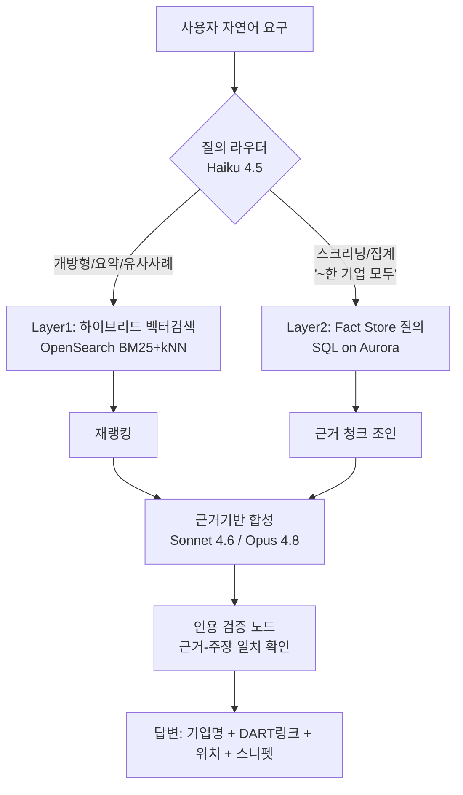
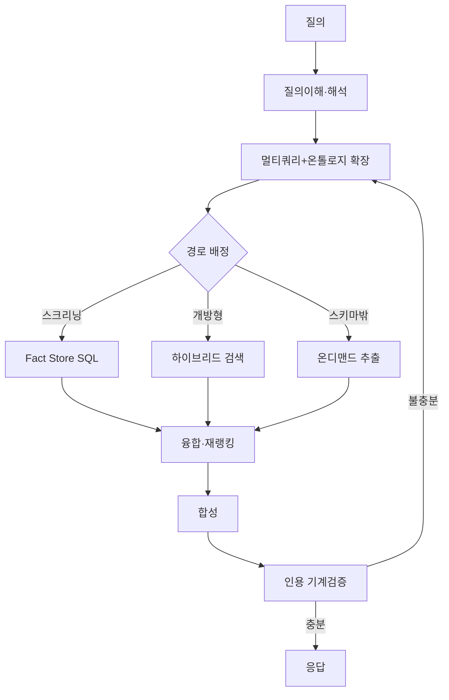
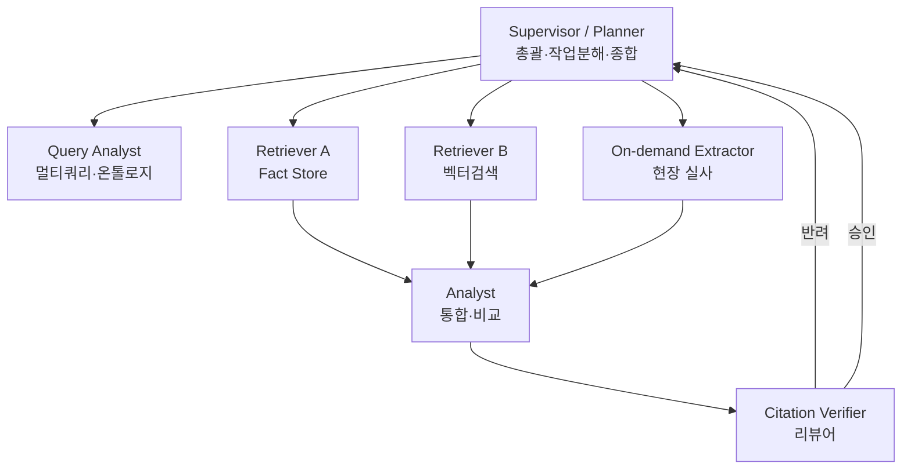
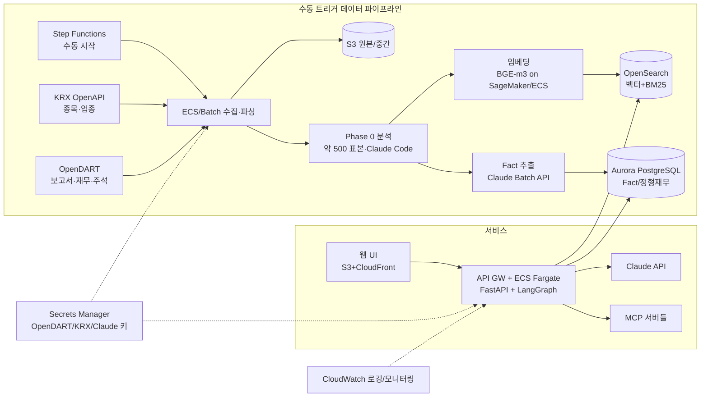

# 감사보고서 분석 RAG 서비스 설계서
### (회계사 업무지원용 — OpenDART · RAG · Claude 기반)

> 버전 0.1 · 작성일 2026-06-24
> 본 문서는 구현 착수를 위한 기준 설계서이며, 각 절은 의사결정 근거와 대안을 함께 제시한다.

---

## 0. 한 장 요약 (TL;DR)

| 항목 | 결정 |
|---|---|
| 데이터 원천 | **OpenDART API**(고유번호·공시검색·공시서류원본파일·DS003 재무정보·주석) + **KRX OpenAPI(사용자 제공)** — 코스피 종목 명단·**업종분류** 수집·검증·활용 |
| 수집 범위 | **코스피 전체 종목**(코스닥 제외) / **최근 3개 사업연도 감사보고서+첨부 재무제표(주석)** + **최근 1개 분기 또는 반기 검토보고서** |
| 개발 착수 원칙 | **데이터 우선(Data-First)**: 전체 개발 착수 전 감사보고서·첨부 재무제표를 **최우선 수집**, **약 500 표본 열람·분석** 후 **설계·개발 전량을 유연하게 수정**(Phase 0 게이트) |
| 핵심 아키텍처 | **질의이해→멀티쿼리(+온톨로지)** 후 **3경로 검색**: ① 벡터/하이브리드(개방형) ② 사전추출 Fact Store(스크리닝) ③ **온디맨드 추출(스키마 밖 자유질의)** |
| 선행 분석(Phase 0) | 임베딩 전 **Claude Code가 약 500 표본 재무제표를 직접 열람·분석**해 임베딩 전략(파서·청킹·단위·메타)·산업분류·설계 전반을 도출/수정 |
| 재무 단위·통화 | XBRL 단위정보 우선 + 표 단위선언 파싱 → **단위 전파·정규화**, 청크 텍스트·메타데이터에 통화·배율 명시(달러/백만원/원 등) |
| 산업별 정리 | **KRX 업종분류**를 1차 기준(+ OpenDART `induty_code` 교차검증), 단 **정리 전 Claude Code가 분류 타당성 검증** → 검증된 산업 택소노미 |
| 임베딩 | 1차 권장 **BGE-m3(하이브리드, 자체 호스팅)** / 매니지드 대안 **Cohere Embed Multilingual v3 (Bedrock)** |
| 벡터스토어 | **Amazon OpenSearch**(BM25+kNN 하이브리드 + 메타데이터 필터) |
| LLM | **Claude API** — 라우팅/추출 `Haiku 4.5`, 합성 기본 `Sonnet 4.6`, 고난도 분석 `Opus 4.8` |
| 오케스트레이션 | **LangGraph** 상태그래프 + **멀티에이전트**(Supervisor·조사·추출·검증), 도구는 **MCP 서버**로 표준화 |
| 배포 | AWS (S3·OpenSearch·Aurora PostgreSQL·ECS Fargate·Step Functions·Secrets Manager) |
| 파이프라인 | 데이터 파이프라인은 구축하되 **사람이 수동 트리거**(파라미터화된 Step Functions / CLI) |
| 산출물 형식 | 답변 = 기업명 + **DART 딥링크(rcpNo+dcmNo로 연결 감사보고서 바로 열기)** + **근거 위치(섹션/주석번호/원문 스니펫)** |

---

## 0.1 v1 확정 결정 & 권장 (사용자 결정 반영)

> 이전까지 "잠정"이던 항목 중, 사용자 결정으로 **확정**된 사항과 그에 따른 **권장값**을 한 곳에 정리한다.

| 항목 | 확정/권장 | 비고 |
|---|---|---|
| **대상 범위** | **코스피 전 종목, 처음부터 전 산업** (코스닥 제외) | 시총 상위 선별 불필요 → 유니버스 단순화 |
| **보고서 범위** | 최근 3개년 **감사보고서+첨부 재무제표** + 최근 1개 **분기/반기 검토보고서** | 감사/검토 구분 태깅 |
| **임베딩 모델** | **BGE-M3 자체 호스팅(확정 기본)** | 한 모델로 dense+sparse(+ColBERT) → 하이브리드 자연 지원, 한국어 우수, 대량 임베딩 시 호출비 0. Phase 0에서 Upstage/Cohere와 골든셋 A/B로 검증 |
| **벡터 저장소** | **Amazon OpenSearch(확정 기본)** | BM25+kNN 하이브리드 + 메타 필터를 한 엔진에서. 정형 Fact/재무는 Aurora PostgreSQL |
| **산업 라벨 기준** | **KRX·DART 둘 다 검증 후 결정**(Phase 0) | 표본으로 사업내용과 일치도 측정 → 우선순위 확정. 메타에는 둘 다 보존 |
| **추출 정확도** | **1순위 평가지표**, 벡터검색은 보조 | 본 서비스 본질=정보추출 파이프라인 |
| **정답지(골든셋)** | **Claude Code + 개발자 공동 검토**로 구축 | 대표 질의 30~50건 + 정답 기업·근거 위치 |
| **인용 검증** | 모델이 **원문 그대로 인용** → **기계 글자 대조**, 실패 주장 폐기 | LLM 자기판단 의존 금지 |
| **개별/연결** | 기본 **연결**, 사용자 토글 | UI 반영됨 |
| **수집 기준** | **연결(CFS) 감사보고서 첨부문서 기준** 수집·임베딩·인용 | 별도(OFS)는 보조 보관 |
| **DART 딥링크** | `rcpNo`+`dcmNo`로 **연결 감사보고서를 바로 열기** | `dcmNo`는 첨부문서 트리에서 해소(Claude Code 확인) |
| **재현성** | **데이터·모델 버전 기록 + as-of 스냅샷** | 같은 질의 동일 결과 |
| **파싱 실패** | **"못 읽은 문서 비율"** 품질지표화 + 비전(이미지) 폴백 | 글자로 안 읽히는 표 대응 |
| **누락 고지** | 답변에 **"적재 N개 기업 기준·누락 가능"** 상시 표기 | UI 반영됨 |

### 미리 뽑을 Fact vs 그 자리에서 뽑기(온디맨드) — 경계와 v1 목록
**쉬운 기준 한 줄**: *자주 묻고·전수로 걸러야 하고·답이 분류로 떨어지면* → **미리 뽑기(Fact Store)**. *가끔 묻고·예상 못 한 주제면* → **그 자리에서 뽑기(온디맨드)**.

- **v1 사전추출 Fact 목록(권장 12종)**: ① 감사의견 유형 ② 핵심감사사항(KAM) 주제 ③ 계속기업 불확실성 ④ 감가상각방법/내용연수 변경 ⑤ 회계정책 변경 ⑥ 회계추정 변경 ⑦ 중요한 소송·우발부채 ⑧ 특수관계자 거래 유의 ⑨ 재고자산 평가방법 ⑩ 수익인식 정책(진행기준 등) ⑪ 감사인(회계법인)·감사보수 ⑫ 내부회계관리제도 검토의견.
- **온디맨드 경계**: 위 목록에 없는 주제(예: IFRS16 리스 영향)는 산업 필터로 후보를 좁힌 뒤 질의 시점 추출.
- **승격 규칙(피드백 루프)**: 온디맨드로 자주 들어오는 주제는 다음 적재 회차에 **사전추출 Fact로 승격**.

### 품질·운영 권장
- **지표**: 추출 정밀/재현율(1순위), 스크리닝 recall, **인용 정확도(기계검증 %)**, 환각율, 파싱 실패율, 질의당 비용·지연.
- **회귀 테스트**: 적재 회차마다 골든셋으로 측정, 버전 비교.
- **휴먼 인 더 루프**: 회계사의 '근거 채택/반려' 로깅 → 추출 프롬프트·재랭킹 개선.
- **운영**: 수동 트리거 파이프라인, 실행마다 버전·비용 리포트, 파싱 실패 Dead-letter 수동 검수.

### 대상 유니버스 예외 규칙(명문화)
신규상장(3년 미만)·상장폐지·합병/분할·사명 변경·결산월 변경·관리종목 등은 유니버스 생성 시 규칙으로 처리: 3년 미만은 보유 연도만 수집(플래그), 사명 변경은 `corp_code` 기준으로 이력 병합, 결산월은 보고서 기간 계산에 반영, 상폐는 과거분만 보존.

---

## 1. 서비스 개요

### 1.1 목적
회계사가 자연어로 요구사항을 입력하면, 다수 기업의 감사보고서·재무제표(주석 포함)를 근거로 **출처가 명확한 답변**을 제공하는 분석 도구.

### 1.2 핵심 가치 제안
- **근거 추적성(Auditability)**: 모든 답변에 기업명·DART 링크·보고서 내 위치·원문 스니펫을 부착. 회계사가 직접 검증 가능해야 함(환각 최소화가 최우선 품질지표).
- **스크리닝 능력**: "건설업 중 감가상각방법을 변경한 기업 전부"처럼 **여러 기업을 가로질러 조건으로 거르는 질의**를 정확히 처리.
- **유사사례 정리**: 특정 산업/기업을 언급하면 유사 회계처리·핵심감사사항(KAM) 사례를 요약 + 링크.

### 1.3 대표 시나리오 (전 구간 워크스루는 §6.6 참조)
> "건설업 중에서 감가상각방법을 변경한 기업 모두 알려줘."
> → 답변: 기업명 리스트 · 각 기업 감사보고서 DART 링크 · "주석 N. 유형자산 — 회계정책의 변경" 위치 · 변경 전/후(예: 정액법→정률법) 원문 근거 스니펫.

### 1.4 개발 착수 원칙 — 데이터 우선(Data-First) ★
**본 설계서는 잠정안이며, 실제 데이터로 검증·수정되는 것을 전제로 한다.** 전체 개발에 착수하기 전에 다음을 **게이트(Phase 0, §3.5)** 로 둔다.

1. **최우선 수집**: 무엇보다 먼저 **감사보고서 및 첨부 재무제표(+최근 분기/반기 검토보고서)** 를 수집한다(인프라·임베딩·LLM 결정보다 앞선다).
2. **약 500 표본 분석**: 산업·규모를 안배한 **약 500건 표본**을 Claude Code가 직접 열람·분석한다.
3. **설계 유연 수정**: 분석 결과(실제 포맷·단위 표기·주석 구조·업종 정합성 등)에 따라 **파싱·임베딩·메타데이터·산업분류·Fact 스키마는 물론, 필요하면 아키텍처 선택까지 전량 재조정**한다.

> 즉, §3~§8의 구체안은 Phase 0 통과 후 **확정**된다. 표본이 가정과 크게 다르면 해당 절을 갱신한다.

---

## 2. 데이터 수집 설계 (OpenDART + KRX)

> 데이터 원천은 둘이다. **종목 유니버스·시가총액·업종분류는 KRX OpenAPI(사용자 제공)** 에서, **보고서 원문·재무·주석은 OpenDART** 에서 수집한다. 두 소스는 **종목코드(stock_code)** 로 조인한다.

### 2.0 수집 범위 (보고서 종류·기간)
| 보고서 | 성격 | 범위 | 비고 |
|---|---|---|---|
| 사업보고서(연차) **감사보고서 + 첨부 재무제표·주석** | 외부감사인 **감사(Audit)** | **최근 3개 사업연도** | 감사의견·KAM·주석 핵심 |
| **분기/반기 검토보고서 + 요약 재무제표** | 외부감사인 **검토(Review)** | **가장 최근 1개 분기 또는 반기** | "감사"가 아닌 **검토**임에 유의(의견 표현·범위 다름) |

> **감사 vs 검토 구분**: 연차는 *감사(적정/한정/부적정/의견거절)*, 분기·반기는 *검토(중요한 수정사항 유무)* 다. 답변·메타데이터에서 두 보고서 유형과 의견 종류를 구분해 표기한다.

### 2.1 대상 기업 선정 (KRX OpenAPI로 수집·검증)
| 구분 | 기준 | 데이터 출처(KRX OpenAPI) |
|---|---|---|
| 코스피 | **전 종목**(코스닥 제외) | KRX '주식' 서비스의 **유가증권 종목기본정보**로 상장 종목·시장구분 수집 |
| 업종분류 | KRX 업종/섹터 | KRX **종목기본정보의 업종·섹터** 필드 → 산업 라벨 후보(§3.5.3, KRX·DART 둘 다 검증 후 결정) |

- **KRX→DART 매핑**: KRX 종목코드(단축코드)로 OpenDART `corpCode.xml`의 `stock_code`와 조인해 `corp_code` 확보.
- **검증·활용**: KRX에서 받은 종목·업종은 그대로 신뢰하지 않고 **Phase 0에서 보고서 '사업의 내용'·DART 정보와 교차검증**(§3.5.3)한다.
- **엔드포인트·필드 명세**: 정확한 API ID·파라미터·필드명은 **사용자가 제공하는 KRX 인증키·서비스 목록** 기준으로 확정한다(KRX OpenAPI는 json/xml 제공).

> 대상은 **코스피 전 종목**으로 고정되며, 선정 기준일(`AS_OF_DATE`)을 파라미터로 두고 회차별로 대상 리스트를 **KRX 기준 스냅샷**으로 저장한다(재현성).

### 2.2 사용할 OpenDART API (DS001/DS003)

| # | API | 엔드포인트(요지) | 용도 |
|---|---|---|---|
| 1 | 고유번호 | `corpCode.xml` (ZIP) | 전체 회사의 `corp_code·corp_name·stock_code` 마스터. **모든 호출의 키** |
| 2 | 기업개황 | `company.json` | 업종코드(표준산업분류 `induty_code`)·법인구분·결산월. **산업 필터의 근거** |
| 3 | 공시검색 | `list.json` | `corp_code`+기간(`bgn_de`,`end_de`)+`pblntf_ty=A`(정기공시)로 **사업보고서·반기보고서·분기보고서**(감사·검토보고서 포함) 접수번호(`rcept_no`) 조회 |
| 4 | 공시서류 원본파일 | `document.xml` (ZIP) | `rcept_no`로 **감사보고서·사업보고서 원본 문서**(XML/HTML) 다운로드 → 본문·주석 파싱 대상 |
| 5 | 단일회사 전체 재무제표 | `fnlttSinglAcntAll.json` | 정형 재무수치(BS/IS/CF, 개별·연결). 구조화 Fact 보강 |
| 6 | XBRL 재무제표 원문 / 주석 일괄다운로드 | XBRL·주석 다운로드 | 정밀 재무·**주석(註釋)** 확보. 감가상각·회계정책 변경 등은 주로 **주석**에 존재 |

> **인증키**: OpenDART API 키는 코드/리포지토리에 두지 않고 **AWS Secrets Manager**에 저장. 일 호출 한도가 있으므로 수집 작업은 레이트리밋·재시도·체크포인트를 갖춘 배치로 설계.

### 2.3 "감사보고서"·"검토보고서"의 소재
감사보고서는 별도 단건 API가 아니라 **정기보고서(사업보고서)에 첨부**되거나 **감사보고서 공시건**으로 접수된다. 따라서 (3) 공시검색으로 후보 `rcept_no`를 모으고, (4) 원본파일을 받아 문서 내에서 "독립된 감사인의 감사보고서" 섹션과 첨부 재무제표·주석을 식별한다. **분기·반기 검토보고서**도 동일하게 해당 분기/반기 보고서(`pblntf_ty=A`)의 원본파일에서 "검토보고서" 섹션과 요약 재무제표를 식별해 수집한다(연차=감사, 분/반기=검토로 태깅).

### 2.4 DART 딥링크 규약 & 연결(CFS) 기준 수집
- **딥링크(권장)**: `https://dart.fss.or.kr/dsaf001/main.do?rcpNo={rcept_no}&dcmNo={dcm_no}`
  - 예) 현대건설 연결 감사보고서: `…?rcpNo=20260318001395&dcmNo=11142436`
  - `dcmNo`는 한 공시(`rcpNo`) 안의 **개별 첨부문서 번호**다. 이를 포함해야 사용자가 **연결 감사보고서를 바로** 펼쳐 볼 수 있다(없으면 공시 첫 화면만 열림).
- **수집 기준 = 연결(CFS)**: 한 사업보고서에는 별도·연결 감사보고서가 함께 첨부되므로, 본 서비스는 **연결 감사보고서 첨부문서를 기준**으로 수집·임베딩·인용한다(재무제표도 `fs_div=CFS`). 별도(OFS)는 보조로만 보관.
- **dcmNo 해소 방법**: 공시 뷰어의 **첨부문서 트리**(`rcpNo`로 조회)에서 문서명이 "연결재무제표에 대한 감사보고서/연결감사보고서"인 노드의 `dcmNo`를 선택해 저장한다. (구현·필드 확인은 Claude Code 단계에서 — 인수인계서 참조.)
- 답변의 모든 근거는 위 **딥링크 + 문서 내 섹션 경로**(예: `재무제표 주석 > 3. 유형자산`)로 표기.

---

## 3. 문서 포맷 분석 & 파싱 설계

> 임베딩 전략은 "포맷을 먼저 이해"하는 데서 출발한다. 아래는 수집 직후 **포맷 인벤토리 단계**에서 확정한다.

### 3.1 원본 문서 구조 특성
- DART 공시 원문은 **구조화된 마크업(XML/HTML 계열)** 으로, 제목·표·문단이 태그로 구분됨.
- 감사보고서 표준 섹션(한국채택국제회계기준 기준):
  1. **감사의견**(적정/한정/부적정/의견거절)
  2. **감사의견의 근거**
  3. **핵심감사사항(KAM)** ← 산업·기업 특이 리스크의 보고
  4. **재무제표**(BS/IS/CF/자본변동표)
  5. **재무제표 주석(註釋)** ← 회계정책, **감가상각방법**, 추정 변경, 우발부채 등 핵심 정보 집중
- **표(table)** 가 많음(재무제표 본문). 표는 일반 텍스트 청킹으로 깨지므로 **표 전용 처리**(행/열 보존 → Markdown 표 또는 (계정명, 기간, 값) 트리플로 정규화) 필요.
- **분기/반기 검토보고서 구조(연차와 다름)**: ① **검토보고서**(검토의견 — "중요한 수정사항 발견되지 않음" 형식, 감사의견과 다름) ② **요약(분기·반기) 재무제표** ③ 축약된 주석. 연차 대비 주석·KAM이 간략하므로 파서는 **보고서유형별로 섹션 기대치를 분기 처리**한다.

### 3.2 파싱 파이프라인 (Claude로 포맷 분석 후 규칙화)
1. **포맷 인벤토리**: 표본 문서 수십 건을 Claude(Sonnet 4.6)로 읽혀 섹션 헤더 패턴·표 구조·주석 번호 체계를 추출 → 파서 규칙(정규식/XPath/휴리스틱) 도출.
2. **섹션 분해**: 문서를 (감사의견 / KAM / 재무제표 / 주석 N) 단위로 분할하고 **섹션 경로 메타데이터**를 부여.
3. **표 정규화**: 재무제표 표 → 계정·기간·금액 정형화(별도 Fact Store로도 적재).
4. **주석 구조화**: 주석을 번호·제목 단위로 분리(유형자산/무형자산/회계정책 변경/우발채무 등).
5. **정합성 체크**: 누락 섹션·인코딩 깨짐·표 파싱 실패 건 격리(Dead-letter)하여 수동 검수.

> **권장**: 파싱은 규칙 기반을 기본으로 하되, 규칙이 실패한 문서만 LLM 폴백으로 처리(비용·속도 균형). 표는 가능한 한 규칙 기반 + XBRL 정형 데이터로 교차검증.

---

## 3.5 [선행 단계 / Phase 0] 첨부 재무제표 실분석 · 재무 단위 식별 · 산업분류 검증

> **원칙: 임베딩은 추측이 아니라 실제 데이터 분석 결과로 설계한다.** 본 단계는 색인·임베딩에 **앞서** 반드시 선행하며, 산출물(아래 *Embedding Spec*·*단위 규칙*·*검증된 산업 택소노미*)이 §3.2 파서와 §4 임베딩, §4.4 메타데이터, §5 검색을 직접 구동한다.

### 3.5.1 첨부 재무제표 실분석 (Claude Code가 직접 열람·분석) — 약 500 표본, 설계 수정 게이트
전체 개발 착수 전(§1.4), OpenDART로 수집한 **감사보고서·첨부 재무제표(+최근 분기/반기 검토보고서)** 중 **약 500건 표본**을 Claude Code가 컨테이너에서 **직접 열람**하고, 스크립트로 패턴을 집계·분석한 뒤 **임베딩 전략은 물론 설계 전반을 유연하게 수정**한다.

- **표본 설계(약 500건)**: **업종**·기업규모·보고서유형(감사/검토)을 **층화**해 약 500건을 추출. 포맷 다양성이 수렴하지 않으면 표본을 확대하고, 특정 표/주석 유형은 전수 점검 대상으로 격리.
- **Claude Code가 분석할 체크리스트**:
  - 표 구조: 병합셀·다단 헤더·비교연도(당기/전기) 컬럼 배치, 개별/연결 구분 표기
  - 계정과목 명칭 변형(동일 계정의 회사별 표기 차이) 및 계층(대·중·소분류)
  - **단위·통화 표기의 위치·형식**(§3.5.2의 핵심 입력)
  - 주석 번호 체계·제목 패턴, 회계정책/추정 변경 서술 위치
  - 음수 표기((123)/△/-), 천단위 구분, 빈칸·대시(–)의 의미, 반올림·표시배율
  - 외화·세그먼트·지주회사 등 예외 케이스
- **산출물 — Embedding Spec(+ 설계 수정안)**: 파서 규칙, 청킹 경계, **단위 처리 규칙**, 메타데이터 필드 확정안, 엣지케이스 목록. 이 스펙이 §3.2/§4를 파라미터화하며, 가정과 크게 다른 부분은 **본 설계서 해당 절을 갱신**한다(§1.4 게이트).

### 3.5.2 재무 단위·통화의 정확한 식별·임베딩 ★(요구사항 반영)
재무 수치는 **단위·통화 없이는 무의미**하다("매출 1,000"이 원인지 백만원인지 USD인지). 한국 재무제표는 표 상단에 `(단위: 원/천원/백만원)`을 선언하고, 외화는 주석에 USD·EUR 등으로 표기된다. 단위를 잘못 인식하면 수치 비교·집계가 전부 틀어진다.

- **권위 소스 우선순위**
  1. **XBRL 구조화 단위정보(최우선)**: `unitRef`(통화코드 KRW/USD 등)·`decimals`/`scale`(자릿수·표시배율). DS003/XBRL 적재분에서 직접 취득 → 가장 신뢰도 높음.
  2. **표 상단·제목의 단위 선언 텍스트 파싱**: 내러티브 재무제표 표.
  3. **주석 내 외화 표기**: 문장 단위 통화 식별(외화환산·외화자산부채 등).
- **처리 규칙**
  - **단위 전파(propagation)**: 한 표의 단위 선언을 그 표의 **모든 수치 셀에 자동 부여**.
  - **정규화(normalization)**: `표시값 × 배율 + 통화` → **정규값(예: KRW 원 단위)** 으로 환산 저장하되, **원본 표시값·표시단위도 함께 보존**(근거 인용·검증용).
  - **임베딩 텍스트에 단위 명시**: 수치/표 청크 텍스트에 `(단위: 백만원, 통화: KRW)`를 **명시적으로 포함** → "백만원 단위로 보고한 기업", "외화(USD)로 표기한 매출" 같은 **단위 자체 질의**가 검색에서 매칭됨.
  - **메타데이터 필드화**: `currency`, `unit_scale`(원/천원/백만원), `is_consolidated` 등(§4.4 반영).
  - **교차검증**: XBRL 단위 ↔ 표 선언 단위 불일치 시 격리(Dead-letter) 후 수동 검수.

### 3.5.3 산업분류 타당성 검증 → 산업별 정리 ★(요구사항 반영)
수집물은 **KRX 업종분류를 1차 기준**으로 산업별 정리하고, **OpenDART `induty_code`(표준산업분류)** 를 **교차검증·보조** 로 사용한다. 단, **정리에 앞서 분류 기준의 타당성을 Claude Code가 검증**한다(잘못된 분류는 "건설업 전부" 류 질의의 recall을 직접 훼손하므로).

- **왜 검증이 필요한가**
  - 등록 주업종이 **실제 사업과 불일치**할 수 있음(지주회사·복합기업: 매출 대부분이 자회사인데 코드는 금융/관리 등).
  - 분류 **세분화 수준**이 서비스가 원하는 묶음("건설업")과 불일치 → 대·중분류 매핑 필요.
  - **KRX 업종 vs DART `induty_code` 불일치** 가능 → 어느 쪽이 회계사 관점의 "산업"에 더 부합하는지 표본으로 판정.
  - 코드 **개정·버전 차이**, **단일 코드의 다중 사업부문 미반영**.
- **검증 방법(Claude Code 수행)**
  1. KRX 업종·DART `induty_code`·기업 표본 3자 대조 → 각 기업의 감사보고서 **'사업의 내용'·주석**과 **일치 여부** 확인.
  2. **그룹 크기 분포** 점검(과대·과소 버킷, 한 기업만 있는 코드 등).
  3. KRX·DART 분류 간 **불일치율** 및 사업내용 기반 분류와의 **불일치율** 산출.
- **산출물(결정)**
  1. **검증된 산업 택소노미**: `(KRX 업종, induty_code) → 서비스 산업라벨`(예: 다수 코드 → "건설업") 매핑 테이블.
  2. **예외 목록**: 지주회사 등 수동 보정 대상.
  3. **권고 구분**: ⓐ KRX 업종 그대로 사용 가능 영역 / ⓑ 매핑·큐레이션 레이어 필요 영역 / ⓒ 사업내용 기반 보조 분류 병행 영역.
- **정리·색인**: 검증 통과 후 감사보고서·첨부 재무제표를 **산업라벨로 색인**하되, 메타데이터에 `industry_name`(서비스 라벨)·`krx_sector`(KRX 업종)·`induty_code`(DART 코드)를 **동시 보유**해 추적성 유지.

---

## 4. 임베딩 전략

### 4.1 청킹(Chunking)
- **섹션-인지 청킹(section-aware)**: 임의 길이 분할 금지. 섹션/주석 단위를 1차 경계로 하고, 길면 토큰 기준(예: 600~900 토큰, 10~15% 오버랩)으로 재분할.
- **컨텍스트 헤더 주입**: 각 청크 앞에 `회사명 · 사업연도 · 보고서유형 · 섹션경로 · (단위/통화)`를 문자열로 덧붙여 검색·인용 정확도↑.
- **표는 별도 청크**: 표는 Markdown 표로 직렬화한 청크 + 정형 트리플 둘 다 유지. **표 청크 텍스트에 단위·통화를 명시**(`(단위: 백만원, 통화: KRW)`)하여 §3.5.2의 단위 질의가 매칭되도록 함.

### 4.2 임베딩 모델 선택 (한국어 회계 도메인)
| 옵션 | 특징 | 권장 시나리오 |
|---|---|---|
| **BGE-m3** (자체 호스팅, SageMaker/ECS) | 다국어·한국어 우수, **dense+sparse(어휘) 동시 산출**로 하이브리드 자연스러움 | **1차 권장**. 도메인 용어(정액법/정률법/유형자산) 어휘 매칭 강함 |
| **Cohere Embed Multilingual v3** (Amazon Bedrock) | 매니지드, 운영 부담↓, 한국어 양호 | 운영 단순화 우선 시 |
| **Upstage Embedding** (API) | 한국어 특화 | 한국어 성능 우선·외부 API 허용 시 |
| Amazon Titan Text Embeddings v2 (Bedrock) | AWS 네이티브, 비용 효율 | 비용 최우선 시 |

> **결정 원칙**: 회계 텍스트는 **정확한 용어 일치가 의미를 좌우**(예: "정액법" vs "정률법")하므로 **어휘 검색(BM25/sparse)과 의미 검색(dense)의 하이브리드**가 필수. BGE-m3가 단일 모델로 둘을 지원해 1차 권장. 최종 선택 전 **자체 평가셋(§11.4)으로 A/B** 권장.

### 4.3 하이브리드 검색
- **BM25(어휘) + dense(의미)** 점수를 결합(예: RRF, Reciprocal Rank Fusion) → 재랭커로 상위 재정렬.
- 회계 고유명사·계정명·법령 인용은 어휘 검색이, 개념·유사사례는 의미 검색이 담당.

### 4.4 메타데이터 스키마(검색 필터·인용의 근간)
```
chunk_id, corp_code, corp_name, stock_code,
market(KOSPI/KOSDAQ), krx_sector, induty_code, industry_name,
fiscal_year, period_type(연차/반기/분기), assurance(감사/검토),
report_type(사업보고서/반기보고서/분기보고서),
rcept_no, dcm_no, dart_url,
section_path(예: "주석>3.유형자산"), note_no,
audit_opinion(감사의견 or 검토결론), is_table(bool),
currency(KRW/USD…), unit_scale(원/천원/백만원), is_consolidated(기본 연결 CFS),
text
```
- 산업·연도·기업·섹션으로 **사전 필터** 후 벡터검색 → 정확도·속도·비용 모두 개선.
- `assurance`로 **감사(연차) vs 검토(분/반기)** 를 구분하고, `industry_name·krx_sector·induty_code`로 산업 필터를 다층 지원한다.
- `currency·unit_scale`은 §3.5.2 단위 식별 결과를 색인에 반영한 것으로, 단위 자체 질의·정확한 수치 비교의 근간이 된다.

### 4.5 사용자 요구의 임베딩 반영 (질의측)
사용자가 산업/기업/주제를 언급하면 임베딩·검색에 다음을 자동 반영:
1. **메타데이터 필터 추출**: "건설업" → `industry_name=건설업`(또는 `induty_code` 매핑), "최근" → `fiscal_year` 범위.
2. **질의 확장**: "감가상각방법 변경" → 동의/관련어("감가상각 정책 변경", "정액법/정률법", "내용연수 변경", "회계추정의 변경") 확장.
3. **섹션 우선순위**: 회계정책·추정 변경류 질의는 **주석 섹션 가중**.

---

## 5. RAG 아키텍처 (질의이해 → 멀티쿼리 → 3경로 검색)

개방형 요약 질의와 스크리닝/집계 질의는 성격이 다르다. 단일 벡터RAG로 둘 다 처리하면 후자에서 누락·환각이 발생한다. 따라서 **질의이해→멀티쿼리(§5.7) 후 3개 검색 경로**(벡터 / Fact Store / 온디맨드 추출)로 분기한다.



### 5.1 Layer 1 — 하이브리드 벡터 RAG (개방형 질의)
"이 산업의 KAM 경향 요약", "유사 회계처리 사례 찾아줘" 등. 메타필터 → 하이브리드 검색 → 재랭킹 → Claude 합성.

### 5.2 Layer 2 — 사전 추출 Fact Store (스크리닝/집계 질의) ★핵심 차별화
**왜 필요한가**: "건설업 중 감가상각방법 변경 기업 *전부*"는 본질적으로 **전수 검사**다. 벡터검색 top-k는 일부만 반환해 **누락**이 발생한다. 해결책은 **수집(ingestion) 시점에 미리 사실을 추출해 구조화 테이블로 적재**하는 것.

- **추출 시점**: 파이프라인 적재 단계에서 각 기업의 주석/회계정책 섹션을 `Haiku 4.5` 또는 `Sonnet 4.6`(Batch API)로 처리.
- **추출 산출물(예)**:
  ```json
  {
    "corp_code": "00126380",
    "fiscal_year": 2024,
    "fact_type": "감가상각방법_변경",
    "detail": {"from": "정액법", "to": "정률법", "asset": "기계장치"},
    "evidence_text": "당사는 당기 중 기계장치의 감가상각방법을 ...",
    "section_path": "주석>3.유형자산",
    "rcept_no": "20250311000123",
    "dcm_no": "11142436",
    "is_consolidated": true,
    "dart_url": "https://dart.fss.or.kr/dsaf001/main.do?rcpNo=20250311000123&dcmNo=11142436"
  }
  ```
- **추출 대상 Fact 예시**: 감가상각방법/내용연수 변경, 회계정책 변경, 회계추정 변경, 감사의견 유형, 핵심감사사항 주제, 계속기업 불확실성, 우발부채/소송, 특수관계자 거래, 재고자산 평가방법 등.
- **수치형 Fact의 단위 보존**: 금액을 포함하는 Fact는 `value_raw·unit_scale·currency·value_krw(정규값)`를 함께 저장(§3.5.2). 단위 누락 수치는 적재 금지·격리.
- **저장**: Aurora PostgreSQL의 `facts` 테이블(+ 원문 스니펫·위치). 스크리닝 질의는 **SQL로 전수·정확·고속** 처리 후 근거 첨부.

> 이 레이어가 "**모두 알려줘**" 류 요구의 정확성과 완전성(recall)을 보장하는 결정적 설계다.

### 5.3 재랭킹(Re-ranking)
- 1차 검색 결과를 cross-encoder 재랭커(예: BGE-reranker) 또는 LLM 재랭킹으로 상위 정렬 → 합성 컨텍스트 품질↑.

### 5.4 인용·근거 보장
- 합성 프롬프트에 **"제공된 근거에만 기반, 근거 없으면 '확인 불가'로 답하라"** 강제.
- **인용 검증 노드**: 생성된 각 주장에 대응하는 근거 청크가 실제로 존재/일치하는지 후검증(불일치 시 해당 주장 제거 또는 재생성).
- 출력 스키마 고정: `회사명 | 결론 | DART링크 | 섹션경로(주석번호) | 원문 스니펫`.

### 5.5 표/수치 질의 처리
재무수치 비교·계산형 질의는 벡터검색 대신 **정형 재무 테이블(DS003/XBRL 적재분)에 SQL/계산**으로 응답하고 근거(보고서·표 위치)를 첨부. 모든 수치는 §3.5.2의 **정규값(통화·배율 환산)** 으로 비교하되, 답변에는 **원본 표시값·표시단위**(예: "1,234백만원")를 함께 제시해 추적성을 유지한다.

### 5.6 대표 시나리오 전 구간 워크스루
> "건설업 중에서 감가상각방법을 변경한 기업 모두 알려줘."

1. **라우팅(Haiku 4.5)**: "모두"+조건 → **스크리닝(Layer 2)** 로 분류.
2. **필터 추출**: `industry_name=건설업`(induty_code 매핑), `fact_type=감가상각방법_변경`, 기간=최근 3년.
3. **Fact Store SQL**: 조건에 맞는 모든 기업·근거 행 조회(전수).
4. **근거 보강**: 각 행의 `evidence_text·section_path·dart_url` 부착, 필요 시 원문 청크 추가 인용.
5. **합성(Sonnet 4.6)**: 기업명 리스트 + 변경 전/후 + 링크 + 위치로 표 형식 정리.
6. **검증**: 각 기업 근거 일치 확인 후 출력.

### 5.7 질의 이해 & 멀티쿼리 생성 (Query Understanding → Multi-Query) ★
사용자의 한 문장을 그대로 검색하지 않는다. **LLM이 먼저 질문을 이해·분석·해석**한 뒤 **여러 개의 쿼리로 분해·확장**해 검색 정확도를 높인다.

1. **질의 해석(Interpretation)**: 의도(요약/스크리닝/수치/단건), 핵심 개념, 제약(산업·연도·시장·개별/연결), **모호성** 탐지.
2. **온톨로지 정규화(§5.8)**: 핵심 개념·산업어를 **표준 개념 + 동의어 + 하위개념**으로 확장.
3. **멀티쿼리 생성**
   - (a) **필터 쿼리**: 메타데이터 필터(산업·연도·`assurance` 등).
   - (b) **패러프레이즈 N개(RAG-Fusion)**: 같은 정보요구를 다른 표현·관점으로 여러 개 생성 → 각각 검색.
   - (c) **분해(sub-questions)**: 복합 질문을 독립 하위질문으로 쪼갬.
   - (d) **경로 배정**: 각 하위질문을 **Fact Store(SQL) / 벡터검색 / 온디맨드 추출** 중 적합한 곳으로 보냄.
4. **병렬 검색 → 결과 융합(RRF) → 중복제거 → 재랭킹**.
5. (옵션) **HyDE**: 가상의 모범답변을 만들어 그 임베딩으로 추가 검색(개방형 질의에 유용).

**제3의 검색 경로 — 온디맨드 추출(스키마 밖 자유질의)**: Fact Store에 미리 안 뽑은 주제(예: "IFRS16 리스 도입으로 부채가 크게 는 건설사")는, ① 메타필터로 **후보군**(건설업 전체)을 좁히고 → ② 그 후보들의 관련 섹션에 **질의 시점 LLM 추출**(병렬/Batch)을 돌려 답한다. 이로써 "사용자가 자유롭게 입력" 약속을 실제로 충족한다.

> 멀티쿼리/온디맨드는 비용·지연이 크므로, 대형 스크리닝은 **비동기(결과를 잠시 후 표시)** 로 처리한다(§비용·지연 정책).

### 5.8 온톨로지 기반 정확도 향상 (Accounting Ontology) ★
회계·감사 도메인 지식을 **구조화한 통제어휘/지식그래프**로 두고, 질의 확장·필터·추출·검증에 공통으로 사용한다.

- **구성**
  - **개념·계층**: 계정과목 트리(자산>유형자산>기계장치), 감가상각방법(정액법/정률법/생산량비례법), 회계변경(정책변경/추정변경/오류수정), 감사의견·검토결론 유형, KAM 주제, 보고서유형.
  - **동의어·표기변형**: 한↔영, 약어, 회사별 표기 차이.
  - **매핑**: KRX 업종 ↔ KSIC(`induty_code`) ↔ 서비스 산업라벨, 한국어 용어 ↔ XBRL 택소노미 요소.
  - **도메인 규칙**: 예) K-IFRS에서 **"감가상각방법 변경"은 회계정책 변경이 아니라 회계추정의 변경**으로 처리 → 질의·추출·답변에서 혼동 방지(정확도 핵심 포인트).
- **활용(정확도↑)**
  1. **질의 확장**: "감가상각 방식 바꾼"도 표준 개념+동의어+하위개념으로 매핑 → recall↑.
  2. **필터 정규화**: "건설업" → 관련 업종코드 집합으로 변환 → 정밀 필터.
  3. **Fact 정규화**: 추출 사실을 표준 `fact_type`으로 통일 → 일관된 스크리닝.
  4. **모호성 해소**: 정책변경 vs 추정변경 등 구분.
  5. **답변 구조화·검증**: 온톨로지로 답변 항목·근거를 점검.
- **구현**: v1은 경량(YAML/관계형 통제어휘 + 동의어 사전), 이후 지식그래프(예: Amazon Neptune)로 확장. 온톨로지는 **멀티쿼리(§5.7)와 Fact 추출(§5.2)을 동시에 구동하는 공용 자산**이다.

---

## 6. LLM 설계 (Claude API)

> Claude API를 사용하되, **단일 모델이 아닌 역할별 모델 라우팅**으로 품질·비용을 동시 최적화한다.

### 6.1 역할별 모델 배치 (현행 라인업 기준)
| 역할 | 모델 | 근거 |
|---|---|---|
| 질의 라우팅·필터 추출·간단 분류 | **Claude Haiku 4.5** ($1/$5 per MTok) | 빠르고 저렴, 분류 정확도 충분 |
| **Ingestion 시 Fact 추출(대량)** | **Claude Sonnet 4.6** + **Batch API** | 대량·비실시간 → Batch 50% 할인 + 프롬프트 캐싱으로 비용 급감 |
| 일반 답변 합성·요약 | **Claude Sonnet 4.6** ($3/$15) | 한국어·추론·1M 컨텍스트 균형의 기본 워크호스 |
| 고난도 교차분석·다단계 추론 | **Claude Opus 4.8** ($5/$25) | 복잡 스크리닝 결과의 심층 해석·비교 시 선택적 사용 |

> 상위 티어(Fable 5/Mythos 5)는 본 서비스엔 과한 비용. 기본은 Sonnet 4.6, 어려운 질의만 Opus 4.8로 에스컬레이션하는 라우팅이 비용 효율적.

### 6.2 비용 최적화 레버
- **프롬프트 캐싱**: 시스템 프롬프트·반복 지시·공통 컨텍스트를 캐시 → 캐시 읽기 약 10% 단가. 정적 콘텐츠를 프롬프트 앞단에 배치.
- **Batch API**: Ingestion Fact 추출·대량 요약 등 비실시간 작업은 Batch로 입·출력 50% 절감(캐싱과 중첩 적용 가능).
- **출력 길이/사고 예산 제어**: 출력 토큰이 비싼 쪽(1:5)이므로 `max_tokens`·thinking 예산을 작업별로 캡.
- **200K 임계 관리**: 1요청 입력이 매우 클 경우 청크 수를 조절(불필요한 초장문 컨텍스트 지양).

### 6.3 프롬프트 설계 원칙
- 출력 스키마(XML/JSON 태그) 강제, "근거 없으면 확인 불가", 회계 용어 정의 주입, few-shot로 인용 형식 고정.

---

## 7. 에이전트 · LangGraph · MCP · 멀티에이전트 (서비스 고도화)

### 7.0 한눈에 보는 개념(쉽게)
- **LLM**: 받은 것만 보고 답한다(도구 못 씀).
- **에이전트**: "지금 검색을 할까? SQL을 돌릴까? 원문을 더 볼까?"를 **스스로 판단하고 결과를 보며 다음 행동을 정하는** LLM. 충분해질 때까지 반복.
- **LangGraph**: 그 반복을 제멋대로 두지 않도록 **순서도(상태그래프)** 로 통제. 노드=작업, 엣지=분기, **재시도·체크포인트·중간상태 저장**.
- **MCP**: 도구를 꽂는 **표준 규격(USB-C 비유)**. OpenDART·KRX·검색·FactStore를 MCP로 만들면 어떤 에이전트·Claude·Claude Code에서도 그대로 재사용.
- **멀티에이전트**: 만능 한 명 대신 **역할별 전문 에이전트 팀 + 총괄(Supervisor)**. (회계법인: 파트너가 일을 나누고, 담당자들이 각자 조사, 리뷰어가 검증.)

### 7.1 LangGraph 상태그래프 (실행 통제)

- **자기교정 루프**: 근거 부족·검증 실패 시 쿼리를 바꿔 재검색(품질 자동 보정).
- **상태 영속화**: 대화·중간결과 저장(후속 질문 맥락 유지·재현성).

### 7.2 MCP 도구 표준화
| MCP 서버 | 노출 도구 | 용도 |
|---|---|---|
| `opendart-mcp` | `search_disclosures`, `get_document`, `get_financials`, `get_company` | 신규/누락 보고서 즉시 조회 |
| `krx-mcp` | `list_securities`, `get_sector` | 종목 유니버스·업종 조회/검증 |
| `retriever-mcp` | `hybrid_search(filters)` | OpenSearch 하이브리드 검색 |
| `factstore-mcp` | `query_facts(industry, fact_type, year)` | 스크리닝/집계 SQL |
| `ontology-mcp` | `expand_concept`, `map_industry` | 개념·동의어 확장, 업종 매핑 |
| `extractor-mcp` | `extract_on_demand(corp, topic)` | 스키마 밖 질의의 질의시점 추출 |
| `citation-mcp` | `build_dart_link(rcept_no)`, `verify_span` | 링크 생성·인용 기계검증 |

> MCP 표준화의 이점: 도구를 Claude API(툴 유즈)·LangGraph·Claude Code 등에서 **그대로 재사용**, 도구 추가·교체가 쉬움.

### 7.3 멀티에이전트 토폴로지 (회계법인 팀 비유)

| 에이전트 | 회계법인 비유 | 역할 | 모델(권장) |
|---|---|---|---|
| **Supervisor/Planner** | 총괄 파트너 | 질의 해석·작업 분해·에이전트 배정·최종 종합 | Opus 4.8(난도↑)/Sonnet |
| **Query Analyst** | 조사 설계 | 멀티쿼리 생성·온톨로지 확장(§5.7·5.8) | Sonnet/Haiku |
| **Retriever ×N(병렬)** | 조사원 | 하위질문별 Fact Store/벡터/문서조회 | Haiku |
| **On-demand Extractor** | 현장 실사 | 스키마 밖 주제를 후보 보고서에서 직접 추출 | Sonnet(Batch/병렬) |
| **Analyst/Synthesizer** | 정리 담당 | 결과 통합·비교·표 구성 | Sonnet/Opus |
| **Citation Verifier** | 리뷰어 | 근거-주장 기계 검증, 미검증 주장 폐기 | Haiku + 규칙 |

- **패턴**: Supervisor + **병렬 fan-out → join**(하위질문 동시 처리 후 합치기).
- **비용 통제**: 단순 질의는 **단일 그래프(§7.1)** 로, **복합·대형 스크리닝만 멀티에이전트 활성화**(난도 신호로 자동 승급).

---

## 8. AWS 배포 아키텍처



| 레이어 | 서비스 | 비고 |
|---|---|---|
| 데이터 소스 | **KRX OpenAPI(사용자 제공)** + **OpenDART** | KRX=종목·업종 / OpenDART=보고서·재무·주석 |
| 원본/중간 저장 | **Amazon S3** | 공시 원본·파싱 산출물·임베딩 캐시 |
| 벡터스토어 | **Amazon OpenSearch** | BM25+kNN 하이브리드, 메타데이터 필터. (간소화 원하면 Aurora `pgvector`도 가능) |
| 정형 DB | **Aurora PostgreSQL** | Fact Store·정형 재무·기업 마스터 |
| 임베딩 | **SageMaker/ECS**(BGE-m3) 또는 **Bedrock**(Cohere/Titan) | §4.2 선택에 따름 |
| 백엔드 | **ECS Fargate + API Gateway** | FastAPI + LangGraph 오케스트레이션 |
| 프런트 | **S3 + CloudFront** (또는 ECS 위 Streamlit) | 회계사용 질의 UI |
| 파이프라인 | **Step Functions**(수동 시작) + **ECS/AWS Batch** | §9 |
| 비밀관리 | **Secrets Manager** | OpenDART·**KRX**·Claude API 키 |
| 관측 | **CloudWatch** (+ 비용·품질 대시보드) | 로깅·알람 |

> **매니지드 단축경로(선택)**: 운영 부담을 줄이려면 **Amazon Bedrock Knowledge Bases**(OpenSearch Serverless + 메타데이터 필터)로 RAG 인프라를 매니지드화하고 LLM만 Claude API로 호출하는 구성도 가능. 단, Fact Store(Layer 2)는 별도 유지 권장.

---

## 9. 데이터 파이프라인 (구축 + 수동 실행)

요건: **파이프라인은 자동화하되 실행은 사람이 수동 트리거**.

### 9.1 단계 (멱등·증분)
> **착수 게이트(§1.4)**: 최초 1회는 `fetch`(보고서 우선 수집)와 `analyze`(약 500 표본 분석)를 먼저 수행해 설계를 확정한 뒤 `embed`/`extract_facts`로 진행한다.

1. `refresh_master` — **KRX OpenAPI**로 코스피 전 종목·**업종분류** 수집 → 스냅샷. OpenDART 고유번호·기업개황과 종목코드로 조인.
2. `discover` — 대상 기업의 **최근 3년 사업보고서 + 최근 1개 분기/반기 보고서** 공시검색 → 신규 `rcept_no`만 식별(증분).
3. `fetch` — 원본파일·재무·주석 다운로드(감사/검토 태깅, 레이트리밋·재시도·체크포인트). **최우선 단계**.
4. `analyze` **(Phase 0, §3.5)** — Claude Code가 **약 500 표본** 실분석 → **Embedding Spec·단위 규칙·검증된 산업 택소노미** 및 **설계 수정안** 산출. (초기 1회 필수, 이후 포맷 변화 감지 시 갱신.)
5. `parse` — 4의 규칙으로 섹션 분해·표 정규화(**단위 전파·정규화**)·주석 구조화, 보고서유형(감사/검토)별 분기 처리, 실패건 격리.
6. `embed` — 청킹·임베딩(단위·통화 텍스트 포함) → OpenSearch 색인.
7. `extract_facts` — Claude Batch로 Fact 추출(수치형은 단위·정규값 포함) → Aurora 적재.
8. `validate` — 색인/Fact 정합성·**단위 교차검증**·**KRX↔DART 산업분류 일치**·커버리지 리포트.

### 9.2 수동 실행 방식
- **Step Functions State Machine**을 콘솔/CLI에서 파라미터와 함께 **수동 시작**:
  ```bash
  aws stepfunctions start-execution \
    --state-machine-arn <ARN> \
    --input '{"market":"kosdaq","year":2024,"top_n":500}'
  ```
- 또는 운영용 CLI: `python pipeline.py run --market kospi --year 2024 --stage all`
- **증분 처리**로 재실행 시 신규 보고서만 반영. 전 단계 실패 시 해당 단계만 재시작.

### 9.3 운영 산출물
- 실행 리포트(처리/실패/커버리지), Dead-letter 큐(수동 검수 대상), 비용 집계.

---

## 10. 서비스 고도화 전략 (RAG·LLM)

1. **3경로 검색 유지·확장**: Fact 유형을 점진 확대(우발부채·소송·계속기업·특수관계자 등) → 스크리닝 가능 주제 확대.
2. **하이브리드+재랭킹 고도화**: RRF 가중·재랭커 모델 튜닝, 도메인 용어 사전(synonym dictionary)으로 질의 확장.
3. **메타데이터 필터 강화**: 산업분류 표준화(KSIC 매핑 테이블), 감사인·감사의견·KAM 주제 태깅.
4. **자기교정 RAG**: 인용 검증 실패 시 재검색·재생성 루프(환각 억제).
5. **평가셋 기반 회귀 테스트**: 회계사가 만든 질의-정답(근거 포함) 셋으로 recall/precision·인용정확도·환각율을 회차마다 측정.
6. **프롬프트 캐싱·Batch 상시화**로 비용 통제.
7. **계산형 질의 라우팅**: 수치 비교·증감률은 정형 재무 테이블 계산으로 분리(LLM 산술 의존 최소화).
8. **점진적 모델 라우팅**: 기본 Sonnet 4.6, 난도·실패 신호 시 Opus 4.8 에스컬레이션.
9. **피드백 루프**: 회계사의 "근거 채택/반려"를 로깅해 재랭킹·Fact 추출 프롬프트 개선.

---

## 11. 품질·보안·비용·한계

### 11.1 품질 KPI
- **인용 정확도**(근거-주장 일치율), **스크리닝 recall**(누락 없음), **환각율**, 응답 지연/비용. 인용 정확도와 recall을 최우선.

### 11.2 보안·컴플라이언스
- 키는 Secrets Manager, 네트워크 분리(VPC), 최소권한 IAM, 접근·질의 감사로그.
- OpenDART/DART 데이터는 공개정보지만 **이용약관·재배포 조건 확인** 및 출처 표기 준수.

### 11.3 비용 통제
- Batch+캐싱으로 LLM 비용 절감, 임베딩은 증분만 재계산, OpenSearch 인덱스 수명주기 관리.

### 11.4 평가 자산
- 산업별 대표 질의 N건 + 정답(기업·근거 위치) 골든셋을 구축해 모델/임베딩 A/B와 회귀 테스트에 사용.

### 11.5 한계·리스크
- 주석 표현의 다양성으로 Fact 추출 누락 가능 → 재현율 모니터링·프롬프트 개선 필요.
- **단위·통화 오인식**(표 단위선언 누락·외화 혼재) 시 수치 전체가 왜곡 → XBRL 교차검증·격리로 방어(§3.5.2).
- **업종 분류 소스 불일치**(KRX 업종 ↔ DART `induty_code` ↔ 실제 사업)로 산업 스크리닝 recall 저하 가능 → Phase 0 검증·매핑 택소노미·예외목록으로 보정(§3.5.3).
- **분기/반기는 감사가 아닌 검토**(보증수준·의견형식 상이) → 연차 감사 결과와 동일시 금지, `assurance` 태깅으로 구분.
- 대상은 코스피 전 종목으로 고정 → `AS_OF_DATE` 기준 KRX 스냅샷·이력 관리로 재현성 확보.
- OpenDART 호출 한도·문서 포맷 변형 → 견고한 재시도·격리 처리.
- 본 도구는 **의사결정 보조**이며, 최종 회계 판단·법적 해석은 회계사 책임.

---

## 12. 단계별 로드맵

| 단계 | 범위 | 산출물 |
|---|---|---|
| **Phase 0 (선행 게이트, §1.4·§3.5)** | 보고서 **최우선 수집**(3년 감사+최근 분/반기 검토) · **약 500 표본** 실분석 · 단위 규칙 · KRX/DART 업종 검증 | Embedding Spec, 단위 처리 규칙, 검증된 산업 택소노미·예외목록, **설계 수정안** |
| **PoC (2~4주)** | 1개 산업(예: 건설업) · 1년치 · Layer1+간이 Fact | 대표 시나리오 end-to-end 데모, 인용 형식 확정 |
| **MVP (4~8주)** | 코스피 전체 · 3년 + 최근 분/반기 · 멀티쿼리+3경로검색 · LangGraph | 수동 파이프라인, 웹 UI, 골든셋 |
| **고도화** | MCP 표준화 · 재랭킹·자기교정 · Fact 유형 확장 · 모델 라우팅 | 비용·품질 대시보드, 회귀 테스트 |

---

### 부록 A. 데이터 흐름 요약
**KRX OpenAPI**(코스피 종목·업종) + **OpenDART 고유번호/기업개황**으로 대상·산업 확정 → 공시검색으로 `rcept_no`(**최근 3년 감사보고서 + 최근 분기/반기 검토보고서**) → 원본·재무·주석 수집 → **[Phase 0] 약 500 표본 실분석(단위 규칙·산업분류 검증·설계 수정)** → 파싱(섹션·표·**단위 정규화**·주석, 감사/검토 구분) → ①임베딩(단위·통화 포함)→OpenSearch ②Fact추출→Aurora → (질의) 라우팅 → 검색 → 합성 → **인용 검증** → 기업명·DART링크·위치·스니펫 답변.

### 부록 B. 즉시 확정 필요한 의사결정 체크리스트
- [ ] **데이터 우선 게이트 운영**(보고서 선수집 → 약 500 표본 분석 → 설계 확정 순서 합의)
- [ ] **KRX OpenAPI 서비스/필드 매핑**(종목·업종 가져올 정확한 API ID·필드, KRX↔DART 종목코드 조인)
- [ ] **수집 범위 확정**(최근 3년 감사 + 최근 분기/반기 검토, 기준일·결산월 처리)
- [ ] **Phase 0 분석 표본 설계**(약 500건의 시장·업종·규모·보고서유형 층화 비율)
- [ ] **단위 처리 규칙 확정**(XBRL 우선순위, 정규값 기준통화/배율, 외화 처리)
- [ ] **산업 택소노미 확정**(KRX 업종 vs DART `induty_code` 우선순위, 지주회사 등 예외)
- [ ] 임베딩: BGE-m3(자체) vs Bedrock 매니지드 — 평가셋으로 A/B
- [ ] 벡터스토어: OpenSearch vs Aurora pgvector vs Bedrock KB
- [ ] Fact 유형 1차 목록 확정(감가상각·회계정책/추정 변경·감사의견·KAM ···)
- [ ] 인용 출력 스키마 최종 확정(섹션 경로 표기 규칙)
